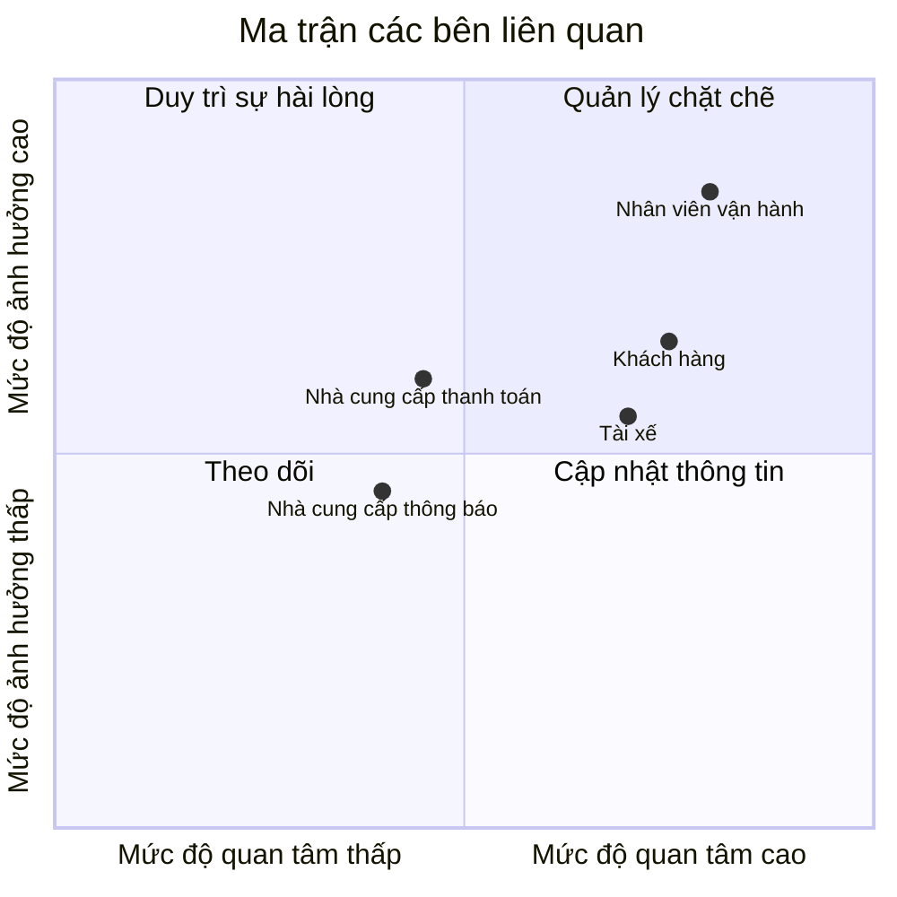
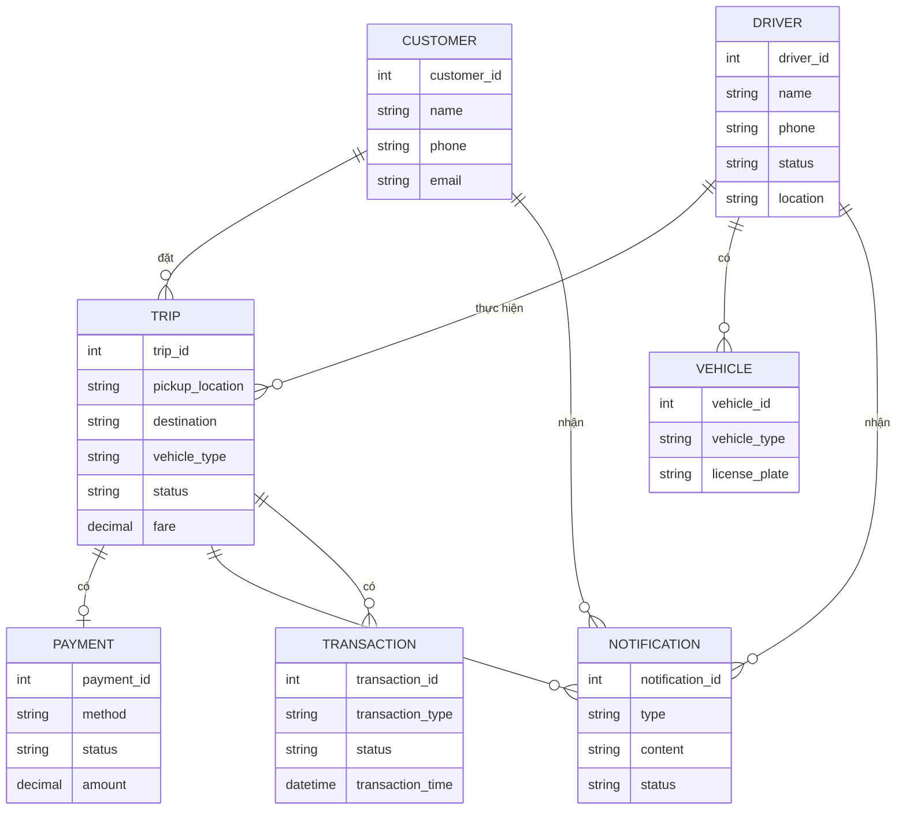
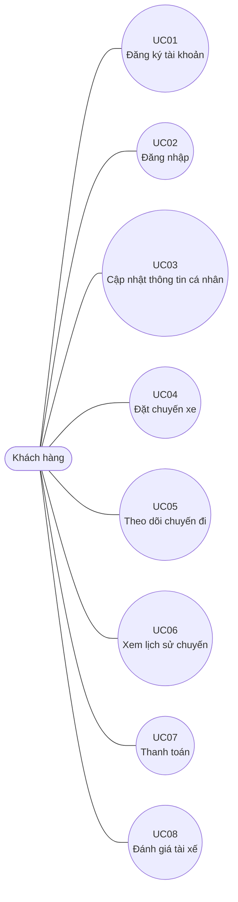
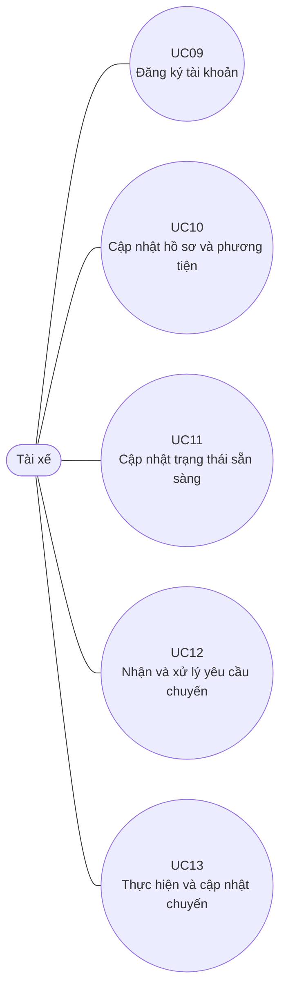
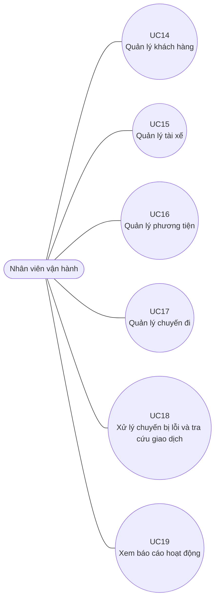
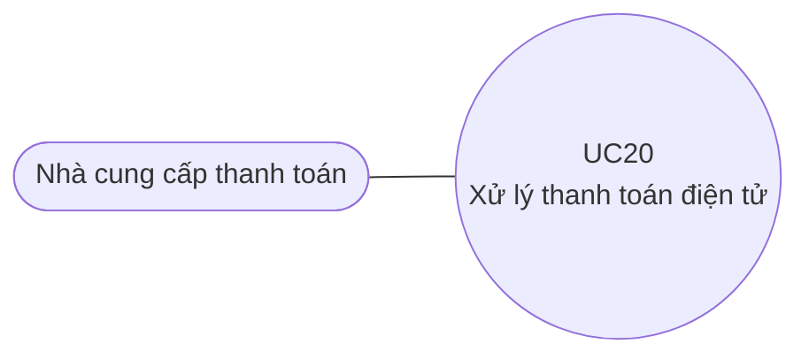
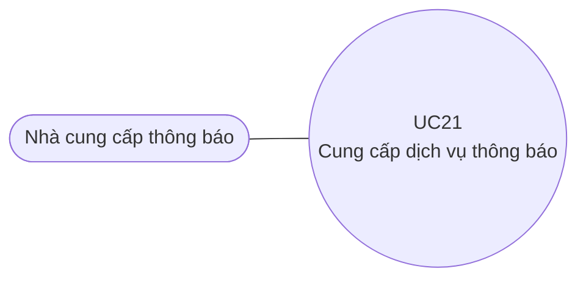

# BA Analysis – CAB System

## 1. Business Context

Công ty ABC cung cấp dịch vụ đặt xe trực tuyến. Khách hàng hiện có thể yêu cầu xe thông qua tổng đài hoặc một ứng dụng đơn giản.

Hệ thống hiện tại còn một số hạn chế:
- Việc phân công tài xế chủ yếu được thực hiện thủ công.
- Khách hàng khó theo dõi trạng thái chuyến đi.
- Thông tin thanh toán chưa được quản lý tập trung.
- Bộ phận vận hành gặp khó khăn khi muốn mở rộng hệ thống.

Do đó, doanh nghiệp muốn xây dựng một nền tảng CAB mới có khả năng phục vụ nhiều khách hàng và tài xế hơn, đồng thời có thể phát triển thêm các chức năng trong tương lai.

## 2. Business Problems

Các vấn đề chính của nghiệp vụ hiện tại:

- Phân công tài xế chủ yếu thực hiện thủ công.
- Khách hàng khó theo dõi trạng thái chuyến đi.
- Thông tin thanh toán chưa được quản lý tập trung.
- Bộ phận vận hành gặp khó khăn khi mở rộng hệ thống.

Do đó, doanh nghiệp cần một hệ thống mới để hỗ trợ tốt hơn việc đặt xe, tìm và phân công tài xế, theo dõi chuyến đi, thanh toán và quản lý hoạt động.

## 3. Questions for Customer

- Cách tính cước cụ thể như thế nào?
- Khi có nhiều tài xế cùng phù hợp thì ưu tiên tài xế nào?
- Tài xế phải phản hồi yêu cầu trong bao lâu?
- Chính sách hủy chuyến được quy định như thế nào?
- Nếu mất kết nối mạng trong quá trình đặt hoặc thực hiện chuyến thì xử lý ra sao?
- Khi thanh toán điện tử thất bại thì hệ thống cần xử lý như thế nào?
- Dữ liệu cần được lưu trữ trong bao lâu?

## 4. Stakeholder

| Tên | Vai trò |
|---|---|
| Khách hàng | Đặt xe, theo dõi chuyến đi, thanh toán và đánh giá tài xế |
| Tài xế | Nhận chuyến, thực hiện chuyến và cập nhật trạng thái chuyến đi |
| Nhân viên vận hành | Quản lý khách hàng, tài xế, phương tiện và chuyến đi |
| Nhà cung cấp thanh toán | Cung cấp dịch vụ thanh toán điện tử |
| Nhà cung cấp thông báo | Cung cấp dịch vụ thông báo |

 ## 5. Stakeholder Matrix

## 6. Business Goals

| Mã | Tên Business Goal | Mục đích |
|---|---|---|
| BG01 | Tự động hóa việc tìm và phân công tài xế | Giảm sự phụ thuộc vào việc phân công tài xế thủ công và giúp khách nhanh chóng tìm được tài xế phù hợp |
| BG02 | Hỗ trợ thanh toán và tính cước | Giúp doanh nghiệp quản lý việc tính tiền và hỗ trợ khách hàng thanh toán bằng tiền mặt hoặc điện tử |
| BG03 | Nâng cao khả năng theo dõi chuyến đi | Giúp khách hàng biết tài xế nào nhận chuyến, thời gian dự kiến đến và trạng thái hiện tại của chuyến |
| BG04 | Tăng khả năng quản lý và vận hành | Giúp nhân viên vận hành quản lý tập trung khách hàng, tài xế, phương tiện và chuyến đi |
| BG05 | Cải thiện việc thông báo | Đảm bảo khách hàng và tài xế nhận được thông tin cần thiết trong quá trình thực hiện chuyến |
| BG06 | Xây dựng nền tảng có khả năng mở rộng và phát triển lâu dài | Giúp doanh nghiệp có thể phục vụ số lượng lớn người dùng và bổ sung chức năng mới trong tương lai |

## 7. Scope of System

### In Scope

Các chức năng nằm trong phạm vi xây dựng hệ thống:

| Module | Chức năng chính |
|---|---|
| Quản lý khách hàng | Đăng ký, đăng nhập, cập nhật thông tin cá nhân |
| Quản lý đặt xe | Nhập điểm đón, điểm đến, chọn loại xe và gửi yêu cầu đặt xe |
| Quản lý tài xế | Quản lý tài khoản, hồ sơ, phương tiện và trạng thái hoạt động của tài xế |
| Tìm và phân công tài xế | Tìm tài xế phù hợp, gửi yêu cầu nhận chuyến và tiếp tục tìm tài xế khác khi bị từ chối hoặc không phản hồi |
| Quản lý chuyến đi | Cập nhật và theo dõi trạng thái chuyến đi |
| Tính cước và thanh toán | Tính số tiền phải trả và hỗ trợ thanh toán tiền mặt hoặc điện tử |
| Thông báo | Gửi thông báo liên quan đến đặt xe, tài xế, chuyến đi và thanh toán |
| Quản lý vận hành | Quản lý khách hàng, tài xế, phương tiện, chuyến đi và tra cứu giao dịch |

### Out of Scope

Các chức năng chưa cần triển khai trong phiên bản MBB:

- Các dịch vụ đặt xe mới ngoài phạm vi yêu cầu hiện tại.
- Các phương thức thanh toán mới ngoài tiền mặt và thanh toán điện tử.
- Các kênh thông báo mới ngoài nhu cầu hiện tại.
- Các chức năng hoặc quy tắc nghiệp vụ chưa được khách hàng xác nhận.

## 8. Business Requirements

| Mã | Tên | Diễn giải |
|---|---|---|
| BR01 | Đặt chuyến | Cho phép khách hàng cung cấp điểm đón, điểm đến, lựa chọn loại xe và gửi yêu cầu đặt chuyến |
| BR02 | Tìm và phân công tài xế | Hệ thống tự động tìm tài xế phù hợp dựa trên vị trí và trạng thái sẵn sàng, đồng thời tiếp tục tìm tài xế khác nếu tài xế được đề xuất không phản hồi hoặc từ chối |
| BR03 | Theo dõi chuyến đi | Cho phép khách hàng theo dõi tài xế, thời gian dự kiến đến và trạng thái hiện tại của chuyến đi |
| BR04 | Tính cước và thanh toán | Hệ thống xác định số tiền khách hàng phải trả và hỗ trợ thanh toán bằng tiền mặt hoặc phương thức thanh toán điện tử |
| BR05 | Quản lý và thông báo chuyến đi | Cho phép nhân viên vận hành quản lý khách hàng, tài xế, phương tiện và chuyến đi; đồng thời hệ thống gửi thông báo về các trạng thái quan trọng của chuyến |
| BR06 | Quản lý và theo dõi hoạt động | Hỗ trợ nhân viên vận hành theo dõi chuyến đang diễn ra, trạng thái tài xế, lịch sử giao dịch và các báo cáo hoạt động |

## 9. Business Processes

### BP01 - Quản lý khách hàng

1. Customer đăng ký tài khoản.
2. System tạo tài khoản cho Customer.
3. Customer đăng nhập.
4. System xác thực thông tin đăng nhập.
5. Customer cập nhật thông tin cá nhân khi cần.

### BP02 - Đặt chuyến xe

1. Customer nhập điểm đón và điểm đến.
2. Customer lựa chọn loại xe.
3. Customer gửi yêu cầu đặt chuyến.
4. System tiếp nhận yêu cầu.
5. System thông báo yêu cầu đã được tiếp nhận.
6. System chuyển sang quy trình tìm và phân công Driver.

**Trường hợp phát sinh:**
- Nếu yêu cầu không thể tiếp nhận, cách xử lý cần được xác nhận với khách hàng.

### BP03 - Tìm và phân công tài xế

1. System xác định các Driver phù hợp dựa trên vị trí, trạng thái sẵn sàng và các tiêu chí vận hành.
2. System ưu tiên Driver phù hợp và gần Customer.
3. System gửi yêu cầu chuyến đến Driver phù hợp.
4. Driver nhận thông báo về chuyến mới.
5. Driver chấp nhận hoặc từ chối chuyến.

**Trường hợp 1: Driver chấp nhận**
- System phân công Driver cho chuyến.
- Customer nhận thông báo Driver đã nhận chuyến.
- System cung cấp thời gian dự kiến Driver đến.

**Trường hợp 2: Driver từ chối**
- System tiếp tục tìm Driver khác.
- Không yêu cầu Customer tạo lại yêu cầu.

**Trường hợp 3: Driver không phản hồi**
- System tiếp tục tìm Driver khác.
- Không yêu cầu Customer tạo lại yêu cầu.

**Trường hợp 4: Không tìm được Driver**
- System thông báo rõ ràng cho Customer.

### BP04 - Thực hiện chuyến đi

1. Driver đến điểm đón.
2. Driver cập nhật trạng thái đã đến điểm đón.
3. Driver đón Customer.
4. Driver cập nhật trạng thái đã đón khách.
5. Driver thực hiện chuyến đi.
6. Driver cập nhật trạng thái đang di chuyển.
7. Driver hoàn thành chuyến.
8. System cập nhật trạng thái chuyến đã hoàn thành.

**Trường hợp phát sinh:**
- Nếu chuyến đi bị lỗi, Operations Staff hỗ trợ xử lý theo quy trình vận hành.
- Cách xử lý cụ thể đối với trường hợp mất kết nối mạng cần được xác nhận với khách hàng.

### BP05 - Tính cước và thanh toán

1. Khi chuyến đi hoàn thành, System xác định số tiền Customer phải trả dựa trên loại dịch vụ và thông tin chuyến đi.
2. Customer chọn phương thức thanh toán.
3. Customer thanh toán bằng tiền mặt hoặc phương thức thanh toán điện tử.

**Trường hợp 1: Thanh toán tiền mặt**
- System ghi nhận phương thức thanh toán tiền mặt.

**Trường hợp 2: Thanh toán điện tử**
- System gửi yêu cầu đến nhà cung cấp thanh toán bên ngoài.
- Nhà cung cấp thanh toán trả về kết quả giao dịch.

**Nếu thanh toán điện tử thành công:**
- System ghi nhận kết quả thanh toán.

**Nếu thanh toán điện tử thất bại:**
- System thông báo cho Customer.
- System cho phép xử lý lại theo chính sách của doanh nghiệp.

**Trường hợp phát sinh:**
- Cách tính cước cụ thể và chính sách xử lý thanh toán lại cần được xác nhận với khách hàng.

### BP06 - Thông báo

1. System thông báo khi yêu cầu đặt xe được tiếp nhận.
2. System thông báo khi Driver nhận chuyến.
3. System thông báo khi Driver đến điểm đón.
4. System thông báo khi chuyến hoàn thành.
5. System thông báo kết quả thanh toán.
6. Driver nhận thông báo về chuyến mới.
7. Driver nhận thông báo khi có thay đổi liên quan đến chuyến đang thực hiện.

**Trường hợp phát sinh:**
- Doanh nghiệp muốn có khả năng bổ sung thêm các kênh thông báo trong tương lai mà không phải thay đổi toàn bộ hệ thống.

### BP07 - Quản lý vận hành

1. Operations Staff đăng nhập vào giao diện quản trị.
2. Operations Staff quản lý Customer, Driver, phương tiện và chuyến đi.
3. Operations Staff xem các chuyến đang diễn ra.
4. Operations Staff kiểm tra trạng thái Driver.
5. Operations Staff hỗ trợ xử lý các trường hợp chuyến bị lỗi.
6. Operations Staff tra cứu lịch sử giao dịch.
7. System kiểm soát quyền đối với các chức năng quản trị nhạy cảm.

### BP08 - Báo cáo hoạt động

1. System tổng hợp dữ liệu hoạt động.
2. Người dùng có quyền xem báo cáo.
3. System cung cấp báo cáo về số lượng chuyến.
4. System cung cấp báo cáo về doanh thu.
5. System cung cấp tỷ lệ chuyến hoàn thành.
6. System cung cấp tỷ lệ hủy.
7. System cung cấp thông tin về hiệu quả hoạt động của Driver.

### Các vấn đề cần xác nhận với khách hàng

- Cách tính cước cụ thể.
- Tiêu chí ưu tiên Driver.
- Thời gian Driver phải phản hồi.
- Chính sách hủy chuyến.
- Cách xử lý khi mất kết nối mạng.
- Thời gian lưu trữ dữ liệu.

## 10. Business Functional Requirements

| Mã | Tên | Diễn giải | BR liên quan |
|---|---|---|---|
| FR01 | Nhập thông tin chuyến | Cho phép Customer nhập điểm đón và điểm đến | BR01 |
| FR02 | Chọn loại xe | Cho phép Customer lựa chọn loại xe trước khi đặt chuyến | BR01 |
| FR03 | Gửi yêu cầu đặt chuyến | Cho phép Customer gửi yêu cầu đặt chuyến đến hệ thống | BR01 |
| FR04 | Xác định vị trí Customer | Xác định vị trí của Customer để phục vụ việc tìm Driver phù hợp | BR02 |
| FR05 | Xác định Driver sẵn sàng | Xác định các Driver đang ở trạng thái sẵn sàng nhận chuyến | BR02 |
| FR06 | Tìm Driver phù hợp | Tìm Driver phù hợp dựa trên vị trí, trạng thái sẵn sàng và các tiêu chí vận hành | BR02 |
| FR07 | Ưu tiên Driver phù hợp và gần Customer | Ưu tiên các Driver phù hợp và gần Customer | BR02 |
| FR08 | Gửi yêu cầu chuyến cho Driver | Gửi thông tin chuyến đến Driver phù hợp để Driver chấp nhận hoặc từ chối | BR02 |
| FR09 | Xử lý Driver từ chối hoặc không phản hồi | Tiếp tục tìm Driver khác khi Driver được đề xuất từ chối hoặc không phản hồi | BR02 |
| FR10 | Thông báo không tìm được Driver | Thông báo cho Customer khi hệ thống không tìm được Driver | BR02 |
| FR11 | Theo dõi Driver | Cho phép Customer biết Driver nào đã nhận chuyến và thời gian dự kiến Driver đến | BR03 |
| FR12 | Theo dõi trạng thái chuyến | Cho phép Customer theo dõi trạng thái hiện tại của chuyến đi | BR03 |
| FR13 | Cập nhật trạng thái chuyến | Cho phép Driver cập nhật các trạng thái đã đến điểm đón, đã đón khách, đang di chuyển và hoàn thành chuyến | BR03 |
| FR14 | Tính cước chuyến đi | Xác định số tiền Customer phải trả dựa trên loại dịch vụ và thông tin chuyến đi | BR04 |
| FR15 | Thanh toán tiền mặt | Cho phép Customer thanh toán bằng tiền mặt | BR04 |
| FR16 | Thanh toán điện tử | Cho phép Customer thanh toán bằng phương thức thanh toán điện tử thông qua nhà cung cấp bên ngoài | BR04 |
| FR17 | Xử lý thanh toán thất bại | Thông báo cho Customer khi thanh toán điện tử thất bại và cho phép xử lý lại theo chính sách của doanh nghiệp | BR04 |
| FR18 | Gửi thông báo đặt xe | Gửi thông báo khi yêu cầu đặt xe được tiếp nhận và khi Driver nhận chuyến | BR05 |
| FR19 | Gửi thông báo chuyến đi | Gửi thông báo khi Driver đến điểm đón, chuyến hoàn thành hoặc có thay đổi liên quan đến chuyến | BR05 |
| FR20 | Gửi thông báo thanh toán | Thông báo cho Customer khi thanh toán có kết quả | BR05 |
| FR21 | Quản lý Customer | Cho phép Operations Staff quản lý thông tin Customer | BR06 |
| FR22 | Quản lý Driver | Cho phép Operations Staff quản lý tài khoản, hồ sơ và trạng thái Driver | BR06 |
| FR23 | Quản lý phương tiện | Cho phép Operations Staff quản lý thông tin phương tiện | BR06 |
| FR24 | Quản lý chuyến đi | Cho phép Operations Staff quản lý và theo dõi các chuyến đi | BR06 |
| FR25 | Tra cứu giao dịch | Cho phép Operations Staff tra cứu lịch sử giao dịch | BR06 |

## 11. Business Rules and Exceptions

### Business Rules

| Mã | Business Rule | Nội dung |
|---|---|---|
| BRULE01 | Chỉ tài xế sẵn sàng mới được nhận chuyến | Hệ thống chỉ gửi yêu cầu chuyến đến Driver đang ở trạng thái sẵn sàng nhận chuyến |
| BRULE02 | Ưu tiên tài xế phù hợp và gần khách | Khi tìm tài xế, hệ thống ưu tiên Driver phù hợp và gần Customer |
| BRULE03 | Không yêu cầu khách đặt lại khi tài xế từ chối | Nếu Driver từ chối chuyến, hệ thống phải tiếp tục tìm Driver khác cho cùng yêu cầu |
| BRULE04 | Không yêu cầu khách đặt lại khi tài xế không phản hồi | Nếu Driver không phản hồi, hệ thống phải tiếp tục tìm Driver khác |
| BRULE05 | Chỉ một tài xế được nhận chuyến | Khi một Driver đã nhận chuyến, hệ thống xác nhận Driver đó cho chuyến và không tiếp tục phân công chuyến đó cho Driver khác |
| BRULE06 | Phải thông báo khi không tìm được tài xế | Nếu không tìm được Driver phù hợp, hệ thống phải thông báo rõ ràng cho Customer |
| BRULE07 | Tính cước sau khi chuyến hoàn thành | Sau khi chuyến đi hoàn thành, hệ thống xác định số tiền Customer phải trả |
| BRULE08 | Không lưu thông tin thanh toán nhạy cảm | Thông tin nhạy cảm của thẻ hoặc tài khoản thanh toán không được lưu trực tiếp trong hệ thống CAB |
| BRULE09 | Thanh toán điện tử phải thông qua nhà cung cấp bên ngoài | Hệ thống CAB tích hợp với nhà cung cấp thanh toán bên ngoài để xử lý thanh toán điện tử |
| BRULE10 | Thanh toán thất bại phải thông báo | Khi thanh toán điện tử thất bại, hệ thống phải thông báo cho Customer và cho phép xử lý lại theo chính sách của doanh nghiệp |
| BRULE11 | Chỉ người có quyền được thực hiện thao tác quản trị nhạy cảm | Các chức năng quản trị phải được kiểm soát quyền truy cập |
| BRULE12 | Người dùng phải được xác thực | Customer và Driver phải được xác thực trước khi sử dụng các chức năng yêu cầu tài khoản |

### Exceptions

| Mã | Exception | Cách xử lý |
|---|---|---|
| EX01 | Driver từ chối chuyến | System tiếp tục tìm Driver khác mà không yêu cầu Customer tạo lại yêu cầu |
| EX02 | Driver không phản hồi | System tiếp tục tìm Driver khác theo quy tắc thời gian phản hồi được xác nhận |
| EX03 | Không tìm được Driver | System thông báo rõ ràng cho Customer và kết thúc yêu cầu đặt chuyến |
| EX04 | Thanh toán điện tử thất bại | System thông báo cho Customer và cho phép xử lý lại theo chính sách của doanh nghiệp |
| EX05 | Chuyến đi bị lỗi | Operations Staff kiểm tra và hỗ trợ xử lý trường hợp chuyến bị lỗi |
| EX06 | Mất kết nối mạng | Cách xử lý cần được xác nhận với khách hàng trước khi triển khai |
| EX07 | Quá thời gian Driver phản hồi | Nếu Driver không phản hồi trong thời gian quy định, System xem như không phản hồi và tiếp tục tìm Driver khác |
| EX08 | Không thể thực hiện chức năng quản trị do thiếu quyền | System từ chối thao tác và không cho phép thực hiện chức năng nhạy cảm |
| FR26 | Xem báo cáo hoạt động | Cung cấp thông tin về số lượng chuyến, doanh thu, tỷ lệ hoàn thành, tỷ lệ hủy và hiệu quả hoạt động của Driver | BR06 |

## 12. Data Model

### Các thực thể chính

| Thực thể | Mục đích |
|---|---|
| Khách hàng | Lưu thông tin khách hàng sử dụng dịch vụ đặt xe |
| Tài xế | Lưu thông tin tài xế và trạng thái hoạt động |
| Phương tiện | Lưu thông tin phương tiện của tài xế |
| Chuyến đi | Lưu thông tin chuyến đi, điểm đón, điểm đến và trạng thái chuyến |
| Thanh toán | Lưu thông tin và kết quả thanh toán của chuyến |
| Thông báo | Lưu thông tin các thông báo liên quan đến chuyến đi và thanh toán |

### Entity Relationship Diagram

## 13. Non-Functional Requirements

| Mã | Tên | Diễn giải |
|---|---|---|
| NFR01 | Khả năng mở rộng | Hệ thống phải có khả năng phục vụ số lượng lớn khách hàng và tài xế, đồng thời các thành phần có thể mở rộng khi tải tăng |
| NFR02 | Tính ổn định | Hệ thống phải hoạt động ổn định khi nhu cầu tăng cao và lỗi ở một thành phần như thanh toán hoặc thông báo không được làm toàn bộ hệ thống ngừng hoạt động |
| NFR03 | Khả năng triển khai từng phần | Các chức năng mới có thể được triển khai từng phần và hạn chế ảnh hưởng đến các chức năng đang hoạt động |
| NFR04 | Bảo mật dữ liệu | Thông tin cá nhân, thông tin phương tiện, dữ liệu vị trí và dữ liệu giao dịch phải được bảo vệ |
| NFR05 | Xác thực người dùng | Customer và Driver phải được xác thực trước khi sử dụng các chức năng yêu cầu tài khoản |
| NFR06 | Phân quyền | Các thao tác quản trị phải được kiểm soát quyền truy cập để ngăn nhân viên không có quyền thực hiện các thao tác nhạy cảm |
| NFR07 | Lưu vết thao tác | Hệ thống phải lưu vết các thao tác quan trọng để phục vụ kiểm tra khi có sự cố |
| NFR08 | Khả năng mở rộng tích hợp | Hệ thống cần có khả năng bổ sung loại dịch vụ mới, phương thức thanh toán hoặc nhà cung cấp thông báo trong tương lai mà không phải xây dựng lại toàn bộ ứng dụng |

## 14. Use Case Diagram

### 14.1 Customer

### 14.2 Driver

### 14.3 Operations Staff

### 14.4 Payment Provider

### 14.5 Notification Provider

## 15. Use Case Specification

### UC01 - Đăng ký tài khoản

| Thành phần | Nội dung |
|---|---|
| Tên Use Case | Đăng ký tài khoản |
| Mô tả | Cho phép Customer tạo tài khoản để sử dụng hệ thống |
| Actor chính | Customer |
| Actor phụ | Không có |
| Tiền điều kiện | Customer chưa có tài khoản |
| Hậu điều kiện | Tài khoản Customer được tạo thành công |

#### Luồng sự kiện chính

| Bước | Customer | System |
|---|---|---|
| 1 | Customer chọn đăng ký tài khoản | System hiển thị biểu mẫu đăng ký |
| 2 | Customer nhập thông tin đăng ký | System tiếp nhận thông tin |
| 3 | Customer gửi thông tin | System kiểm tra thông tin |
| 4 |  | System tạo tài khoản |
| 5 |  | System thông báo đăng ký thành công |

#### Luồng sự kiện thay thế

| Bước | Xử lý |
|---|---|
| 3.1 | Thông tin đăng ký không hợp lệ → System thông báo và yêu cầu Customer nhập lại |

---

### UC02 - Đăng nhập

| Thành phần | Nội dung |
|---|---|
| Tên Use Case | Đăng nhập |
| Mô tả | Cho phép Customer truy cập hệ thống bằng tài khoản |
| Actor chính | Customer |
| Actor phụ | Không có |
| Tiền điều kiện | Customer đã có tài khoản |
| Hậu điều kiện | Customer đăng nhập thành công |

#### Luồng sự kiện chính

| Bước | Customer | System |
|---|---|---|
| 1 | Customer chọn đăng nhập | System hiển thị form đăng nhập |
| 2 | Customer nhập thông tin đăng nhập | System tiếp nhận thông tin |
| 3 | Customer gửi thông tin | System xác thực thông tin |
| 4 |  | System cho phép Customer truy cập |

#### Luồng sự kiện thay thế

| Bước | Xử lý |
|---|---|
| 3.1 | Thông tin đăng nhập không hợp lệ → System thông báo đăng nhập thất bại |

---

### UC03 - Cập nhật thông tin cá nhân

| Thành phần | Nội dung |
|---|---|
| Tên Use Case | Cập nhật thông tin cá nhân |
| Mô tả | Cho phép Customer cập nhật thông tin cá nhân |
| Actor chính | Customer |
| Actor phụ | Không có |
| Tiền điều kiện | Customer đã đăng nhập |
| Hậu điều kiện | Thông tin cá nhân được cập nhật |

#### Luồng sự kiện chính

| Bước | Customer | System |
|---|---|---|
| 1 | Customer chọn cập nhật thông tin | System hiển thị thông tin hiện tại |
| 2 | Customer chỉnh sửa thông tin | System tiếp nhận thông tin |
| 3 | Customer xác nhận cập nhật | System kiểm tra thông tin |
| 4 |  | System lưu thông tin mới |
| 5 |  | System thông báo cập nhật thành công |

#### Luồng sự kiện thay thế

| Bước | Xử lý |
|---|---|
| 3.1 | Thông tin không hợp lệ → System yêu cầu Customer chỉnh sửa |

---

### UC04 - Đặt chuyến xe

| Thành phần | Nội dung |
|---|---|
| Tên Use Case | Đặt chuyến xe |
| Mô tả | Cho phép Customer tạo yêu cầu đặt chuyến |
| Actor chính | Customer |
| Actor phụ | Driver |
| Tiền điều kiện | Customer đã đăng nhập |
| Hậu điều kiện | Yêu cầu đặt chuyến được tiếp nhận hoặc Customer được thông báo không tìm được Driver |

#### Luồng sự kiện chính

| Bước | Customer | System | Driver |
|---|---|---|---|
| 1 | Customer nhập điểm đón và điểm đến |  |  |
| 2 | Customer chọn loại xe |  |  |
| 3 | Customer gửi yêu cầu đặt chuyến | System tiếp nhận yêu cầu |  |
| 4 |  | System xác định Driver phù hợp |  |
| 5 |  | System gửi yêu cầu chuyến | Driver nhận yêu cầu |
| 6 |  |  | Driver chấp nhận chuyến |
| 7 |  | System xác nhận Driver cho chuyến |  |
| 8 |  | System thông báo kết quả |  |

#### Luồng sự kiện thay thế

| Bước | Xử lý |
|---|---|
| 6.1 | Driver từ chối → System tiếp tục tìm Driver khác |
| 6.2 | Driver không phản hồi → System tiếp tục tìm Driver khác |
| 6.3 | Không tìm được Driver → System thông báo cho Customer |

---

### UC05 - Theo dõi chuyến đi

| Thành phần | Nội dung |
|---|---|
| Tên Use Case | Theo dõi chuyến đi |
| Mô tả | Cho phép Customer theo dõi tình trạng chuyến |
| Actor chính | Customer |
| Actor phụ | Driver |
| Tiền điều kiện | Customer có chuyến đang thực hiện |
| Hậu điều kiện | Customer xem được trạng thái chuyến |

#### Luồng sự kiện chính

| Bước | Customer | System | Driver |
|---|---|---|---|
| 1 | Customer mở thông tin chuyến | System hiển thị thông tin chuyến |  |
| 2 |  | System hiển thị Driver và thời gian dự kiến đến |  |
| 3 |  | System hiển thị trạng thái chuyến | Driver cập nhật trạng thái |
| 4 | Customer theo dõi trạng thái | System cập nhật thông tin |  |

#### Luồng sự kiện thay thế

| Bước | Xử lý |
|---|---|
| 3.1 | Chưa có thông tin cập nhật mới → System hiển thị trạng thái hiện tại |

---

### UC06 - Xem lịch sử chuyến

| Thành phần | Nội dung |
|---|---|
| Tên Use Case | Xem lịch sử chuyến |
| Mô tả | Cho phép Customer xem các chuyến đã thực hiện |
| Actor chính | Customer |
| Actor phụ | Không có |
| Tiền điều kiện | Customer đã đăng nhập |
| Hậu điều kiện | Lịch sử chuyến được hiển thị |

#### Luồng sự kiện chính

| Bước | Customer | System |
|---|---|---|
| 1 | Customer chọn lịch sử chuyến | System tìm lịch sử chuyến |
| 2 |  | System hiển thị danh sách chuyến |
| 3 | Customer chọn chuyến cần xem | System hiển thị chi tiết chuyến |

#### Luồng sự kiện thay thế

| Bước | Xử lý |
|---|---|
| 2.1 | Không có lịch sử chuyến → System thông báo chưa có chuyến |

---

### UC07 - Thanh toán

| Thành phần | Nội dung |
|---|---|
| Tên Use Case | Thanh toán |
| Mô tả | Cho phép Customer thanh toán chi phí chuyến đi |
| Actor chính | Customer |
| Actor phụ | Payment Provider |
| Tiền điều kiện | Chuyến đi đã hoàn thành |
| Hậu điều kiện | Kết quả thanh toán được ghi nhận |

#### Luồng sự kiện chính

| Bước | Customer | System | Payment Provider |
|---|---|---|---|
| 1 | Customer xem số tiền phải trả | System xác định số tiền |  |
| 2 | Customer chọn phương thức thanh toán | System tiếp nhận phương thức |  |
| 3 | Customer chọn thanh toán điện tử | System gửi yêu cầu thanh toán | Payment Provider xử lý |
| 4 |  |  | Payment Provider trả kết quả |
| 5 |  | System ghi nhận kết quả |  |

#### Luồng sự kiện thay thế

| Bước | Xử lý |
|---|---|
| 3.1 | Customer chọn tiền mặt → System ghi nhận phương thức thanh toán tiền mặt |
| 4.1 | Thanh toán điện tử thất bại → System thông báo Customer và cho phép xử lý lại theo chính sách |

---

### UC08 - Đánh giá tài xế

| Thành phần | Nội dung |
|---|---|
| Tên Use Case | Đánh giá tài xế |
| Mô tả | Cho phép Customer đánh giá Driver sau khi hoàn thành chuyến |
| Actor chính | Customer |
| Actor phụ | Không có |
| Tiền điều kiện | Chuyến đã hoàn thành |
| Hậu điều kiện | Đánh giá được ghi nhận |

#### Luồng sự kiện chính

| Bước | Customer | System |
|---|---|---|
| 1 | Customer chọn đánh giá chuyến | System hiển thị chức năng đánh giá |
| 2 | Customer nhập đánh giá | System tiếp nhận đánh giá |
| 3 | Customer gửi đánh giá | System lưu đánh giá |
| 4 |  | System thông báo đánh giá thành công |

#### Luồng sự kiện thay thế

| Bước | Xử lý |
|---|---|
| 3.1 | Thông tin đánh giá không hợp lệ → System yêu cầu Customer nhập lại |

---

### UC09 - Đăng ký tài khoản

| Thành phần | Nội dung |
|---|---|
| Tên Use Case | Đăng ký tài khoản |
| Mô tả | Cho phép Driver đăng ký tài khoản |
| Actor chính | Driver |
| Actor phụ | Operations Staff |
| Tiền điều kiện | Driver chưa có tài khoản |
| Hậu điều kiện | Tài khoản Driver được tạo |

#### Luồng sự kiện chính

| Bước | Driver | System | Operations Staff |
|---|---|---|---|
| 1 | Driver đăng ký tài khoản | System tiếp nhận thông tin |  |
| 2 |  | System tạo tài khoản |  |
| 3 |  |  | Operations Staff có thể tạo tài khoản Driver theo yêu cầu |

#### Luồng sự kiện thay thế

| Bước | Xử lý |
|---|---|
| 2.1 | Thông tin không hợp lệ → System yêu cầu nhập lại |

---

### UC10 - Cập nhật hồ sơ và phương tiện

| Thành phần | Nội dung |
|---|---|
| Tên Use Case | Cập nhật hồ sơ và phương tiện |
| Mô tả | Cho phép Driver cập nhật hồ sơ và thông tin phương tiện |
| Actor chính | Driver |
| Actor phụ | Không có |
| Tiền điều kiện | Driver đã có tài khoản |
| Hậu điều kiện | Thông tin được cập nhật |

#### Luồng sự kiện chính

| Bước | Driver | System |
|---|---|---|
| 1 | Driver mở hồ sơ | System hiển thị thông tin |
| 2 | Driver cập nhật hồ sơ/phương tiện | System tiếp nhận |
| 3 | Driver xác nhận | System lưu thông tin |
| 4 |  | System thông báo thành công |

#### Luồng sự kiện thay thế

| Bước | Xử lý |
|---|---|
| 3.1 | Thông tin không hợp lệ → System yêu cầu chỉnh sửa |

---

### UC11 - Cập nhật trạng thái sẵn sàng

| Thành phần | Nội dung |
|---|---|
| Tên Use Case | Cập nhật trạng thái sẵn sàng |
| Mô tả | Cho phép Driver chuyển sang trạng thái sẵn sàng nhận chuyến |
| Actor chính | Driver |
| Actor phụ | Không có |
| Tiền điều kiện | Driver đã đăng nhập |
| Hậu điều kiện | Trạng thái Driver được cập nhật |

#### Luồng sự kiện chính

| Bước | Driver | System |
|---|---|---|
| 1 | Driver chọn trạng thái sẵn sàng | System tiếp nhận |
| 2 |  | System cập nhật trạng thái |
| 3 |  | System đưa Driver vào danh sách có thể nhận chuyến |

#### Luồng sự kiện thay thế

| Bước | Xử lý |
|---|---|
| 2.1 | Driver chuyển sang không sẵn sàng → System không đưa Driver vào danh sách tìm chuyến |

---

### UC12 - Nhận và xử lý yêu cầu chuyến

| Thành phần | Nội dung |
|---|---|
| Tên Use Case | Nhận và xử lý yêu cầu chuyến |
| Mô tả | Cho phép Driver nhận và phản hồi yêu cầu chuyến |
| Actor chính | Driver |
| Actor phụ | Customer |
| Tiền điều kiện | Driver đang sẵn sàng |
| Hậu điều kiện | Chuyến được Driver chấp nhận hoặc hệ thống tiếp tục tìm Driver khác |

#### Luồng sự kiện chính

| Bước | Driver | System |
|---|---|---|
| 1 |  | System gửi thông báo chuyến mới |
| 2 | Driver xem yêu cầu | System hiển thị thông tin chuyến |
| 3 | Driver chấp nhận | System ghi nhận Driver nhận chuyến |
| 4 |  | System thông báo Customer |

#### Luồng sự kiện thay thế

| Bước | Xử lý |
|---|---|
| 3.1 | Driver từ chối → System tìm Driver khác |
| 3.2 | Driver không phản hồi → System tiếp tục tìm Driver khác |

---

### UC13 - Thực hiện và cập nhật chuyến

| Thành phần | Nội dung |
|---|---|
| Tên Use Case | Thực hiện và cập nhật chuyến |
| Mô tả | Cho phép Driver thực hiện chuyến và cập nhật trạng thái |
| Actor chính | Driver |
| Actor phụ | Customer |
| Tiền điều kiện | Driver đã nhận chuyến |
| Hậu điều kiện | Chuyến được hoàn thành hoặc được chuyển xử lý khi có lỗi |

#### Luồng sự kiện chính

| Bước | Driver | System |
|---|---|---|
| 1 | Driver đến điểm đón |  |
| 2 | Driver cập nhật đã đến điểm đón | System cập nhật trạng thái |
| 3 | Driver đón Customer |  |
| 4 | Driver cập nhật đã đón khách | System cập nhật trạng thái |
| 5 | Driver thực hiện chuyến | System cập nhật trạng thái đang di chuyển |
| 6 | Driver hoàn thành chuyến | System cập nhật chuyến hoàn thành |

#### Luồng sự kiện thay thế

| Bước | Xử lý |
|---|---|
| 5.1 | Chuyến bị lỗi → Operations Staff hỗ trợ xử lý |

---

### UC14 - Quản lý khách hàng

| Thành phần | Nội dung |
|---|---|
| Tên Use Case | Quản lý khách hàng |
| Mô tả | Cho phép Operations Staff quản lý thông tin Customer |
| Actor chính | Operations Staff |
| Actor phụ | Không có |
| Tiền điều kiện | Operations Staff đã đăng nhập và có quyền |
| Hậu điều kiện | Thông tin Customer được quản lý |

#### Luồng sự kiện chính

| Bước | Operations Staff | System |
|---|---|---|
| 1 | Mở chức năng quản lý khách hàng | System hiển thị danh sách Customer |
| 2 | Chọn Customer | System hiển thị thông tin |
| 3 | Thực hiện thao tác quản lý | System ghi nhận thay đổi |

#### Luồng sự kiện thay thế

| Bước | Xử lý |
|---|---|
| 3.1 | Không đủ quyền → System từ chối thao tác |

---

### UC15 - Quản lý tài xế

| Thành phần | Nội dung |
|---|---|
| Tên Use Case | Quản lý tài xế |
| Mô tả | Cho phép Operations Staff quản lý Driver |
| Actor chính | Operations Staff |
| Actor phụ | Driver |
| Tiền điều kiện | Operations Staff có quyền |
| Hậu điều kiện | Thông tin Driver được quản lý |

#### Luồng sự kiện chính

| Bước | Operations Staff | System |
|---|---|---|
| 1 | Mở quản lý tài xế | System hiển thị danh sách Driver |
| 2 | Chọn Driver | System hiển thị hồ sơ và trạng thái |
| 3 | Thực hiện thao tác quản lý | System lưu thay đổi |

#### Luồng sự kiện thay thế

| Bước | Xử lý |
|---|---|
| 3.1 | Không đủ quyền → System từ chối thao tác |

---

### UC16 - Quản lý phương tiện

| Thành phần | Nội dung |
|---|---|
| Tên Use Case | Quản lý phương tiện |
| Mô tả | Cho phép Operations Staff quản lý thông tin phương tiện |
| Actor chính | Operations Staff |
| Actor phụ | Driver |
| Tiền điều kiện | Operations Staff có quyền |
| Hậu điều kiện | Thông tin phương tiện được quản lý |

#### Luồng sự kiện chính

| Bước | Operations Staff | System |
|---|---|---|
| 1 | Mở quản lý phương tiện | System hiển thị danh sách |
| 2 | Chọn phương tiện | System hiển thị thông tin |
| 3 | Cập nhật thông tin | System lưu thông tin |

#### Luồng sự kiện thay thế

| Bước | Xử lý |
|---|---|
| 3.1 | Không đủ quyền → System từ chối thao tác |

---

### UC17 - Quản lý chuyến đi

| Thành phần | Nội dung |
|---|---|
| Tên Use Case | Quản lý chuyến đi |
| Mô tả | Cho phép Operations Staff theo dõi và quản lý chuyến |
| Actor chính | Operations Staff |
| Actor phụ | Customer, Driver |
| Tiền điều kiện | Operations Staff đã đăng nhập |
| Hậu điều kiện | Thông tin chuyến được theo dõi và quản lý |

#### Luồng sự kiện chính

| Bước | Operations Staff | System |
|---|---|---|
| 1 | Mở danh sách chuyến | System hiển thị các chuyến |
| 2 | Chọn chuyến | System hiển thị thông tin và trạng thái |
| 3 | Kiểm tra chuyến đang diễn ra | System hiển thị trạng thái hiện tại |
| 4 | Thực hiện thao tác quản lý khi cần | System ghi nhận thao tác |

#### Luồng sự kiện thay thế

| Bước | Xử lý |
|---|---|
| 4.1 | Chuyến bị lỗi → chuyển sang xử lý chuyến bị lỗi |

---

### UC18 - Xử lý chuyến bị lỗi và tra cứu giao dịch

| Thành phần | Nội dung |
|---|---|
| Tên Use Case | Xử lý chuyến bị lỗi và tra cứu giao dịch |
| Mô tả | Cho phép Operations Staff hỗ trợ xử lý chuyến lỗi và tra cứu lịch sử giao dịch |
| Actor chính | Operations Staff |
| Actor phụ | Không có |
| Tiền điều kiện | Operations Staff có quyền |
| Hậu điều kiện | Trường hợp lỗi được xử lý hoặc giao dịch được tra cứu |

#### Luồng sự kiện chính

| Bước | Operations Staff | System |
|---|---|---|
| 1 | Chọn chuyến cần xử lý | System hiển thị thông tin |
| 2 | Kiểm tra trường hợp lỗi | System cung cấp dữ liệu liên quan |
| 3 | Operations Staff thực hiện xử lý | System ghi nhận thao tác |
| 4 | Operations Staff tra cứu giao dịch khi cần | System hiển thị lịch sử giao dịch |

#### Luồng sự kiện thay thế

| Bước | Xử lý |
|---|---|
| 3.1 | Không đủ quyền → System từ chối thao tác |

---

### UC19 - Xem báo cáo hoạt động

| Thành phần | Nội dung |
|---|---|
| Tên Use Case | Xem báo cáo hoạt động |
| Mô tả | Cho phép Operations Staff theo dõi tình hình hoạt động |
| Actor chính | Operations Staff |
| Actor phụ | Không có |
| Tiền điều kiện | Operations Staff có quyền xem báo cáo |
| Hậu điều kiện | Báo cáo được hiển thị |

#### Luồng sự kiện chính

| Bước | Operations Staff | System |
|---|---|---|
| 1 | Mở chức năng báo cáo | System tổng hợp dữ liệu |
| 2 | Chọn loại báo cáo | System xử lý dữ liệu |
| 3 |  | System hiển thị số chuyến, doanh thu, tỷ lệ hoàn thành, tỷ lệ hủy và hiệu quả Driver |

#### Luồng sự kiện thay thế

| Bước | Xử lý |
|---|---|
| 3.1 | Không có dữ liệu → System thông báo không có dữ liệu báo cáo |

---

### UC20 - Xử lý thanh toán điện tử

| Thành phần | Nội dung |
|---|---|
| Tên Use Case | Xử lý thanh toán điện tử |
| Mô tả | Nhà cung cấp thanh toán xử lý giao dịch thanh toán điện tử |
| Actor chính | Payment Provider |
| Actor phụ | Customer, System |
| Tiền điều kiện | Customer chọn phương thức thanh toán điện tử |
| Hậu điều kiện | Kết quả giao dịch được trả về System |

#### Luồng sự kiện chính

| Bước | System | Payment Provider |
|---|---|---|
| 1 | System gửi yêu cầu thanh toán |  |
| 2 |  | Payment Provider tiếp nhận yêu cầu |
| 3 |  | Payment Provider xử lý giao dịch |
| 4 |  | Payment Provider trả kết quả |
| 5 | System nhận và ghi nhận kết quả |  |

#### Luồng sự kiện thay thế

| Bước | Xử lý |
|---|---|
| 4.1 | Giao dịch thất bại → Payment Provider trả kết quả thất bại để System thông báo Customer |

---

### UC21 - Cung cấp dịch vụ thông báo

| Thành phần | Nội dung |
|---|---|
| Tên Use Case | Cung cấp dịch vụ thông báo |
| Mô tả | Nhà cung cấp thông báo hỗ trợ gửi các thông báo của hệ thống |
| Actor chính | Notification Provider |
| Actor phụ | Customer, Driver |
| Tiền điều kiện | System phát sinh sự kiện cần gửi thông báo |
| Hậu điều kiện | Thông báo được gửi đến đối tượng cần nhận |

#### Luồng sự kiện chính

| Bước | System | Notification Provider |
|---|---|---|
| 1 | System tạo yêu cầu gửi thông báo |  |
| 2 |  | Notification Provider tiếp nhận |
| 3 |  | Notification Provider gửi thông báo |
| 4 |  | Trả kết quả gửi |
| 5 | System ghi nhận kết quả |  |

#### Luồng sự kiện thay thế

| Bước | Xử lý |
|---|---|
| 3.1 | Gửi thông báo không thành công → System ghi nhận kết quả để xử lý theo cơ chế thông báo của hệ thống |

## 16. Acceptance Criteria

| Mã AC | Business Requirement | Tiêu chí chấp nhận |
|---|---|---|
| AC01 | BR01 - Đặt chuyến | Customer có thể nhập điểm đón, điểm đến và chọn loại xe |
| AC02 | BR01 - Đặt chuyến | Customer có thể gửi yêu cầu đặt chuyến và System tiếp nhận yêu cầu |
| AC03 | BR01 - Đặt chuyến | Sau khi tiếp nhận yêu cầu, System phải thông báo trạng thái tiếp nhận cho Customer |
| AC04 | BR02 - Tìm và phân công tài xế | System chỉ tìm và gửi yêu cầu đến Driver đang sẵn sàng và phù hợp với chuyến |
| AC05 | BR02 - Tìm và phân công tài xế | Khi Driver chấp nhận, System phải xác nhận Driver đó cho chuyến và thông báo cho Customer |
| AC06 | BR02 - Tìm và phân công tài xế | Khi Driver từ chối hoặc không phản hồi, System phải tiếp tục tìm Driver khác mà Customer không cần tạo lại yêu cầu |
| AC07 | BR02 - Tìm và phân công tài xế | Khi không tìm được Driver phù hợp, System phải thông báo rõ ràng cho Customer |
| AC08 | BR03 - Theo dõi chuyến đi | Customer có thể xem Driver đã nhận chuyến và thời gian dự kiến Driver đến |
| AC09 | BR03 - Theo dõi chuyến đi | Customer có thể xem trạng thái hiện tại của chuyến đi |
| AC10 | BR03 - Theo dõi chuyến đi | Driver có thể cập nhật các trạng thái: đã đến điểm đón, đã đón khách, đang di chuyển và hoàn thành chuyến |
| AC11 | BR04 - Tính cước và thanh toán | Sau khi chuyến hoàn thành, System phải xác định được số tiền Customer phải trả |
| AC12 | BR04 - Tính cước và thanh toán | Customer có thể chọn thanh toán bằng tiền mặt hoặc phương thức thanh toán điện tử |
| AC13 | BR04 - Tính cước và thanh toán | Thanh toán điện tử phải được xử lý thông qua nhà cung cấp thanh toán bên ngoài |
| AC14 | BR04 - Tính cước và thanh toán | Khi thanh toán điện tử thất bại, System phải thông báo cho Customer và cho phép xử lý lại theo chính sách của doanh nghiệp |
| AC15 | BR05 - Quản lý và thông báo | Customer nhận được thông báo khi yêu cầu đặt xe được tiếp nhận, Driver nhận chuyến, Driver đến điểm đón và chuyến hoàn thành |
| AC16 | BR05 - Quản lý và thông báo | Customer nhận được thông báo về kết quả thanh toán |
| AC17 | BR05 - Quản lý và thông báo | Driver nhận được thông báo về chuyến mới hoặc thay đổi liên quan đến chuyến đang thực hiện |
| AC18 | BR06 - Quản lý và theo dõi hoạt động | Operations Staff có thể quản lý Customer, Driver, phương tiện và chuyến đi |
| AC19 | BR06 - Quản lý và theo dõi hoạt động | Operations Staff có thể xem chuyến đang diễn ra, trạng thái Driver và tra cứu lịch sử giao dịch |
| AC20 | BR06 - Quản lý và theo dõi hoạt động | System cung cấp báo cáo về số lượng chuyến, doanh thu, tỷ lệ hoàn thành, tỷ lệ hủy và hiệu quả Driver |
| AC21 | BR06 - Quản lý và theo dõi hoạt động | Các thao tác quản trị nhạy cảm chỉ được thực hiện bởi người có quyền |

